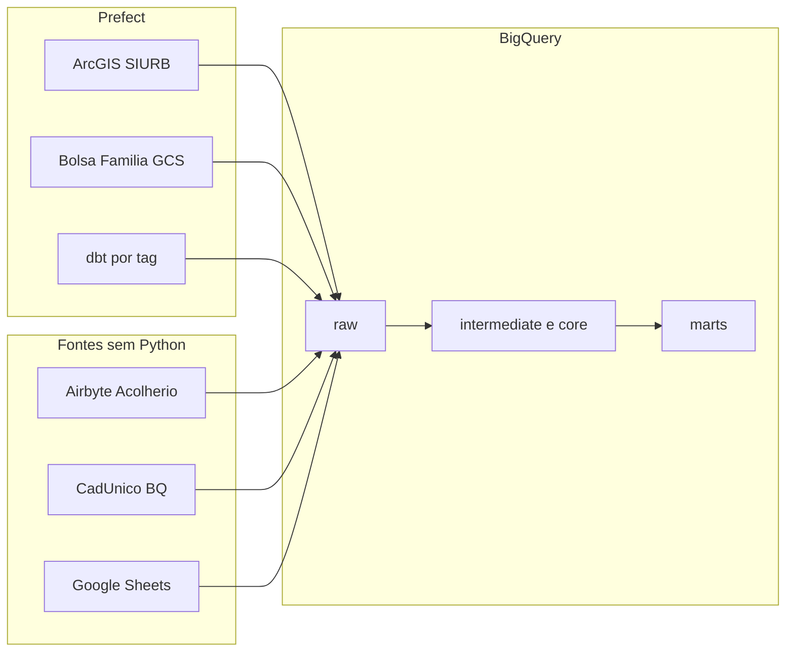

# Docs de onboarding e base da IA

O repositório **rj-smas / pipelines** é a plataforma de dados da Secretaria Municipal de Assistência Social (Rio). Tem dois eixos: ingestão/orquestração em **Prefect 3** (`pipelines/`) e transformação **dbt + BigQuery** (`queries/`), em arquitetura Medallion.

Já existem [README.md](README.md) (setup) e [queries/ARCHITECTURE.md](queries/ARCHITECTURE.md) (camadas dbt). Faltam: mapa do monorepo, guia de estudo para review, e regras persistentes para o Cursor. A nova pasta `docs/` complementa esses arquivos; não reescreve a arquitetura Medallion.

## 1. Documentação em `docs/` (português)

Criar pasta nova, com índice e quatro guias curtos. Cada arquivo aponta para o código real (não inventar processo).

- [docs/README.md](docs/README.md) — índice: o que ler primeiro, mapa dos arquivos, link de volta ao [README.md](README.md) e ao [queries/ARCHITECTURE.md](queries/ARCHITECTURE.md).
- [docs/visao-geral.md](docs/visao-geral.md) — para que serve o projeto, stack (Python 3.13, uv, Prefect 3, dbt-bigquery, Recce), ambientes (`rj-smas-dev` / `rj-smas`, `MODE` staging|prod, target dbt `dev`/`staging`/`prod`/`ci`), e o que **não** está no Python (CadÚnico, Prontuário e Sheets entram só via `source()` no dbt).
- [docs/estrutura.md](docs/estrutura.md) — pastas de topo (`pipelines/`, `queries/`, `.github/`, `prefect.yaml`, `sqlfluff_libs/`), camadas dbt resumidas com link para ARCHITECTURE.md, nomenclatura (`raw_`, `int_`, `dim_`/`fct_`, `mart_`), e o que ainda vive em `old_architecture/` (default desligado; ainda ligados: `dashboard_arcgis`, `equipamentos`, `bolsa_familia`).
- [docs/como-usar.md](docs/como-usar.md) — setup já descrito no README (uv, gcloud ADC, `dbt debug`); comandos do dia a dia (`dbt run --select … --project-dir queries --profiles-dir queries`); como rodar um flow Prefect local (`uv run python pipelines/…/flows.py` + `MODE` + `SIURB_*` quando for ArcGIS); CI relevante (lint em linhas tocadas, `dbt parse --target ci`, Recce slim em PRs que mudam SQL).
- [docs/estudo-e-code-review.md](docs/estudo-e-code-review.md) — trilha de estudo em ordem (README → este índice → ARCHITECTURE → um raw → um core → um mart → um flow Prefect) e checklists de review:
  - **dbt:** `source()` só em `raw/` (exceções documentadas, ex. PIC), sem duplicar lógica do `intermediate/core`, YAML irmão com testes de chave, tags `daily`/`weekly`/`monthly`, incrementais idempotentes, macros de partição CadÚnico.
  - **Python:** flow novo precisa de entrada em [prefect.yaml](prefect.yaml), nomes de tabela alinhados aos `_sources.yml`, sem credenciais no código, `MODE` consistente.

No [README.md](README.md), só um bloco curto **Documentação** apontando para `docs/` — sem reescrever o onboarding.

## 2. Base da IA do Cursor (híbrido)

Seguir o skill de regras: arquivos `.mdc` em [`.cursor/rules/`](.cursor/rules/), concisos (cerca de 50 linhas), um tema por regra.

- [`.cursor/rules/projeto-smas.mdc`](.cursor/rules/projeto-smas.mdc) — `alwaysApply: true`. Identidade do repo, pastas, stack, ambientes, ponteiro para `docs/` e ARCHITECTURE.md, regra de ouro: raw isola fontes; lógica de negócio no intermediate/core; marts só consomem `ref()`.
- [`.cursor/rules/dbt-medallion.mdc`](.cursor/rules/dbt-medallion.mdc) — `globs: queries/**/*.{sql,yml}` `alwaysApply: false`. Camadas e materializações, nomenclatura, `source()` vs `ref()`, YAML 1:1, testes de grain, tags, cuidado com `old_architecture/`.
- [`.cursor/rules/pipelines-prefect.mdc`](.cursor/rules/pipelines-prefect.mdc) — `globs: pipelines/**/*.py` `alwaysApply: false`. Padrão flow → task → BQ → `dbt run/build --select`; `MODE`/`BaseSettings`; secrets só via env; registrar deploy em `prefect.yaml`; acoplamento com sources dbt.

Não criar `AGENTS.md` (as regras `.mdc` já são a base persistente do Cursor).

## 3. Fora de escopo

- Não alterar modelos dbt, flows, CI ou `ARCHITECTURE.md`.
- Não traduzir nem reescrever a documentação de negócio em `queries/models/marts/rma_cras/*.md`.
